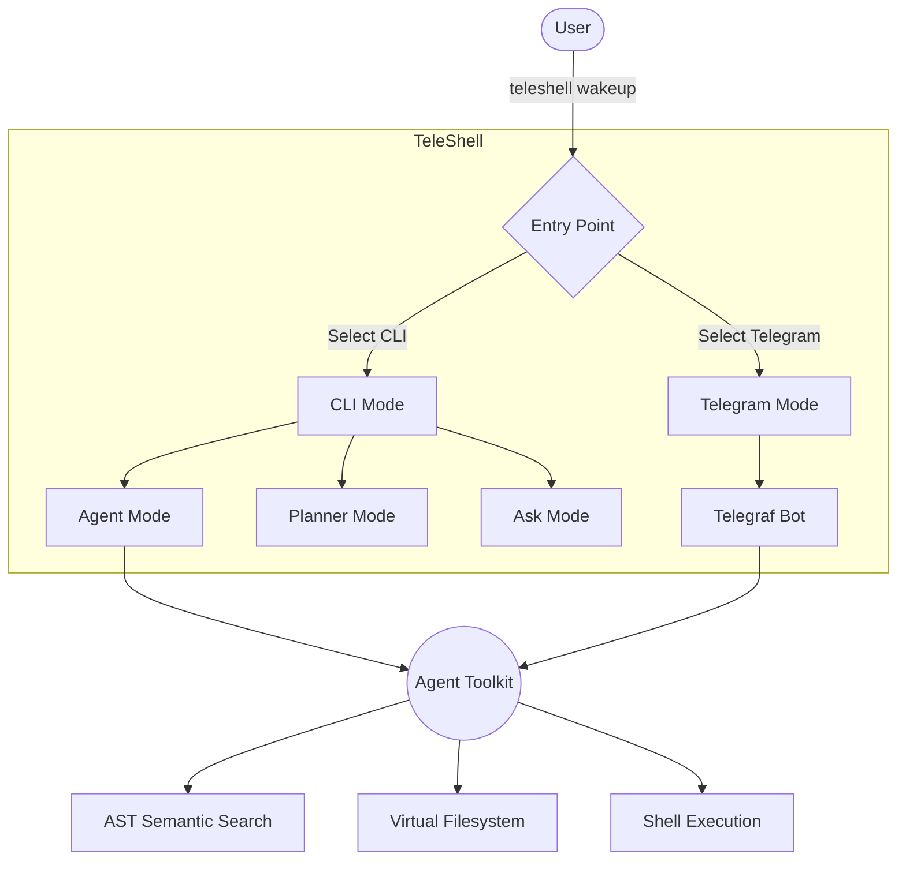

# TeleShell

A lightweight, terminal-centric shell that lets you interact with an AI-powered assistant. The project demonstrates how to use the `ai` library together with `@clack/prompts` to build a functional command-line assistant, along with a Telegram bot integration for remote usage.

## Features

* **Wake-up Banner** – A welcoming interactive screen generated with `figlet` and `chalk`.
* **Multi-Mode Entry** – `teleshell wakeup` starts the interactive session where you can choose between **CLI** and **Telegram** modes.
* **CLI Sub-Modes**:
  * **Agent Mode**: A highly autonomous terminal agent that can read/edit files using precise line-based boundaries, search code via AST semantic search, run background processes, scrape the web using Firecrawl, and analyze Git context. All mutations are strictly staged in a Virtual Filesystem and require your approval before executing.
  * **Planner Mode**: Plan tasks and orchestrate more complex workflows using web search and deep research.
  * **Ask Mode**: Direct Q&A with the LLM.
* **Telegram Mode**: Run TeleShell as a Telegram bot using `telegraf`, allowing you to control and interact with the AI assistant remotely.
* **Modular Architecture** – Organized folders for `ai`, `modes` (like `agent`, `ask`, `plan`, `telegram`), and `tui`. New modes can be added with minimal friction.

## Getting Started

### Prerequisites

- [Bun](https://bun.sh/) installed.
- (Optional) For Telegram mode: A Telegram bot token and your Telegram User ID.

### Installation

```bash
# Clone the repository
git clone https://github.com/your-org/teleshell.git
cd teleshell

# Install dependencies using Bun
bun install
```

### Environment Variables

For Telegram mode to work, create a `.env` file in the root directory:

```env
TELEGRAM_BOT_TOKEN=your_telegram_bot_token
TELEGRAM_OWNER_ID=your_telegram_user_id
```
Make sure to configure the AI SDK environment variables depending on your chosen provider in `ai.config.ts` (e.g. `OPENAI_API_KEY`).

### Running TeleShell

```bash
# Run the interactive shell
bun run index.ts wakeup   # or
npx teleshell wakeup
```

### Running Globally (Standalone Executable)

Bun allows you to compile the entire project into a single, standalone executable. This is the cleanest way to make `teleshell` available anywhere on your system without relying on global package managers.

```bash
# Compile into an executable
bun build ./index.ts --compile --outfile teleshell
```

**Setup for Windows:**
1. Create a dedicated folder for custom scripts (e.g., `C:\Users\YourUser\bin`).
2. Move the newly generated `teleshell.exe` into this folder.
3. Add this folder to your system's `PATH` environment variable:
   - Press the Windows key, type `env`, and select **Edit the system environment variables**.
   - Click **Environment Variables...**.
   - Under *User variables*, edit **Path**, click **New**, and add the path to your new folder.
   - Click **OK** to save on all windows.
4. Restart your terminal. You can now type `teleshell wakeup` from any directory.

**Setup for macOS/Linux:**
Move the binary to a directory in your `PATH`, such as `/usr/local/bin`:
```bash
sudo mv teleshell /usr/local/bin/teleshell
```
You can now run `teleshell wakeup` globally.

### Running the Telegram Bot in the Background (Windows)

If you want the Telegram bot to have full access to your PC and run silently in the background without needing to keep a terminal open, you can use a hidden Windows script.

1. Ensure you have compiled the standalone executable (`teleshell.exe`) and added it to your `PATH`.
2. Open **Notepad** (or any text editor) and paste the following code into it:
   ```vbscript
   Set WshShell = CreateObject("WScript.Shell")
   ' Update this path to exactly where your .env file is located
   WshShell.CurrentDirectory = "C:\Users\prans\Desktop\TeleShell"
   ' The --cwd flag tells the bot to start operating from the specified directory (e.g., C:\)
   WshShell.Run "teleshell telegram --cwd ""C:\""", 0, False
   ```
3. Save the file: Go to **File > Save As**, change "Save as type" to **All Files (\*.\*)**, and name the file `start-teleshell.vbs`.
4. Double-click the file to start the bot silently. To stop it, kill `teleshell.exe` in Task Manager.

**Run automatically on startup:**
Press `Win + R`, type `shell:startup`, and copy the `start-teleshell.vbs` script into the folder that opens. The bot will now run automatically in the background every time your PC boots (Note: It may take a minute or two for the bot to start after boot).

## Usage

After launching, you'll see a banner and a main menu.

### CLI Mode
Select **CLI** to run the local terminal UI. You'll be prompted to choose a sub-mode:
- **Agent mode**: Describe your goal, and the agent will read files, stage file modifications, and queue shell commands using a virtual filesystem. You must approve the batch of changes before anything is written to disk or executed.
- **Planner mode**: Useful for complex queries requiring multiple steps.
- **Ask mode**: Direct Q&A with the LLM.

### Telegram Mode
Select **Telegram** to start the Telegram bot. It will send a welcome message to the `TELEGRAM_OWNER_ID` specified in your `.env` file. You can then interact with the bot from the Telegram app.

## Architecture



## Project Structure

```
├─ ai            # AI configuration & core SDK integration
├─ modes         # Feature implementations: agent, ask, plan, telegram
├─ tui           # Terminal UI helpers (banner, interactive prompts)
├─ index.ts      # CLI bootstrap and entry point
└─ package.json  # Dependencies and scripts
```

## Agent Toolkit

The built-in Agent mode is equipped with an advanced arsenal of tools designed to navigate and manage a codebase safely:
1. **Precise File Editing**: Uses exact line-range slicing to read and replace specific chunks of code, bypassing the token limits and whitespace errors of traditional diff-based agents.
2. **AST Semantic Search**: Powered by `ts-morph`, the agent perfectly locates class, function, and interface definitions without brute-forcing text matching. By passing only the isolated Abstract Syntax Tree node to the LLM instead of the entire file, it achieves an **~88-95% reduction in context-token consumption** per lookup.
3. **Dynamic Shell & Background Tasks**: The agent can run read-only shell commands mid-thought to debug errors, or spin up detached background processes (like `npm run dev`) and monitor their logs.
4. **Firecrawl Web Integration**: The agent can scrape documentation URLs or search the web to research dependencies before writing code.
5. **Git Awareness**: Built-in tools allow the agent to inspect `git status` and `git diff` to seamlessly pick up where you left off.

## Contributing

Pull requests are welcome! If you want to add a new mode:
1. Create a new folder under `modes/` (e.g., `modes/my-mode`).
2. Expose an orchestrator function.
3. Add the command option in `tui/wakeup.ts` or `modes/cli.ts`.

## License

MIT